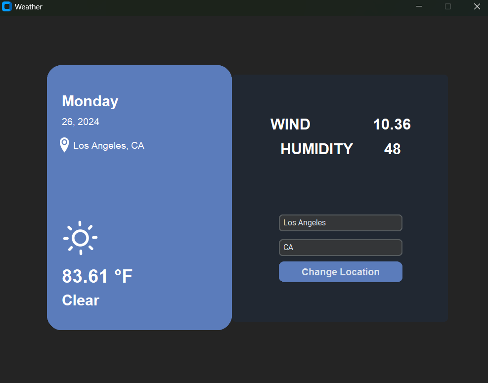

# TKInter Desktop Weather App


## SETUP

### Prerequisites

- Python 3.8 or higher
- Pip

### Installation:
````
python3 -m venv .venv \
.venv\Scripts\activate
````

### Install the required dependencies:
````
pip install -r requirements.txt
````

### Set up an API key
You can get a free API key from [OpenWeatherMap](https://openweathermap.org/)
````
weather_app_API_key=your_api_key_here
````